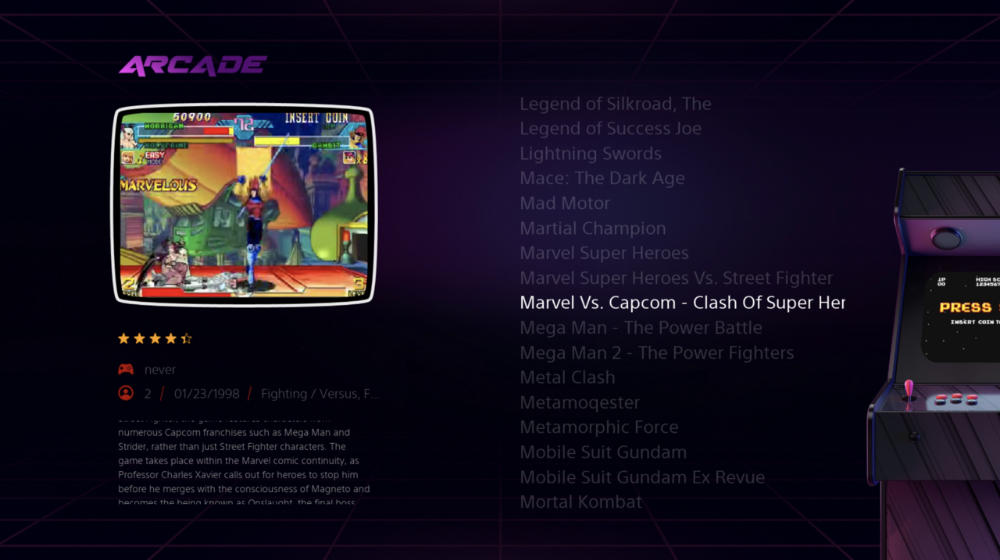
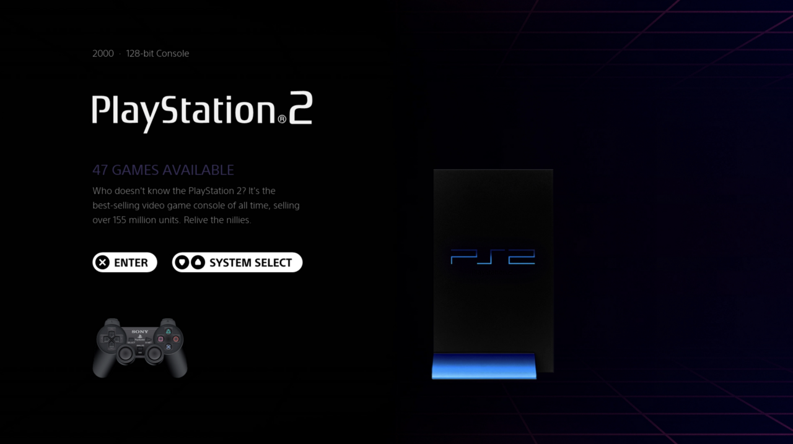
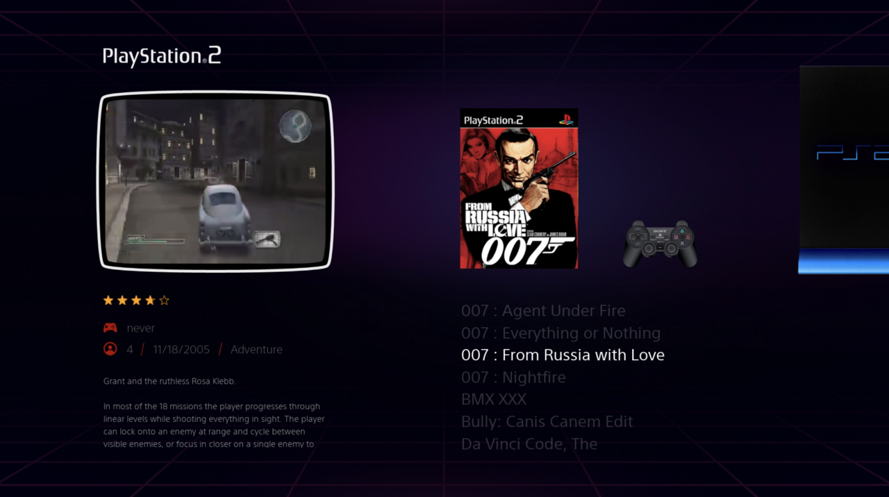
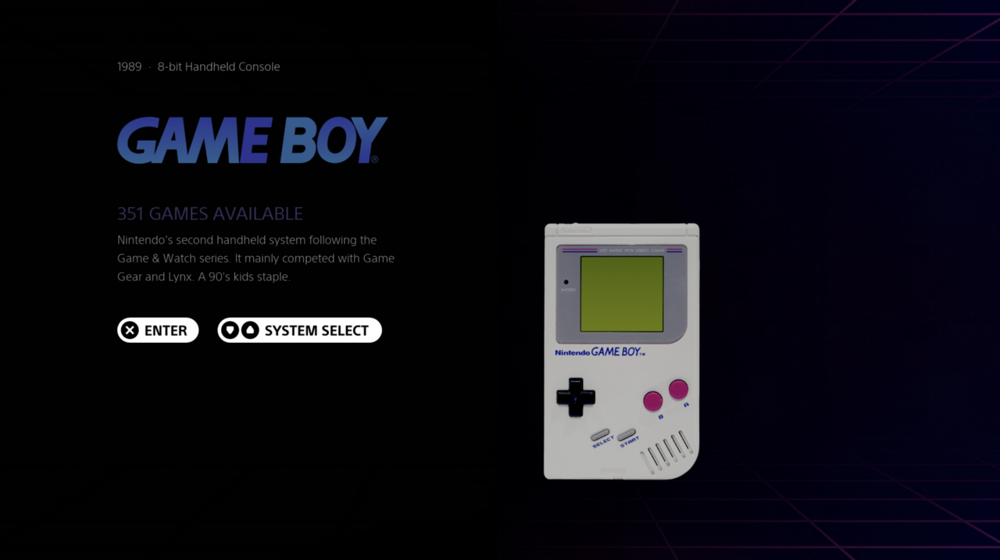
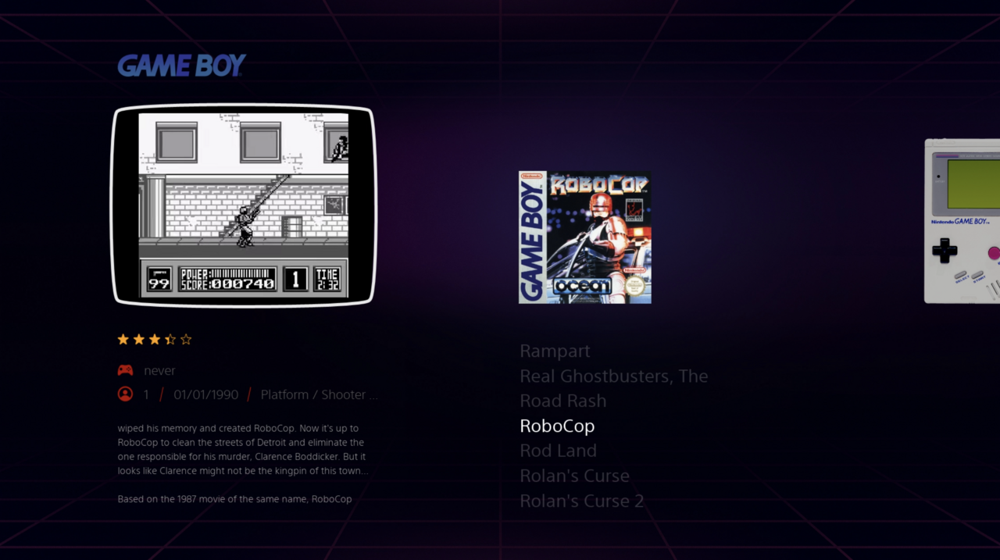
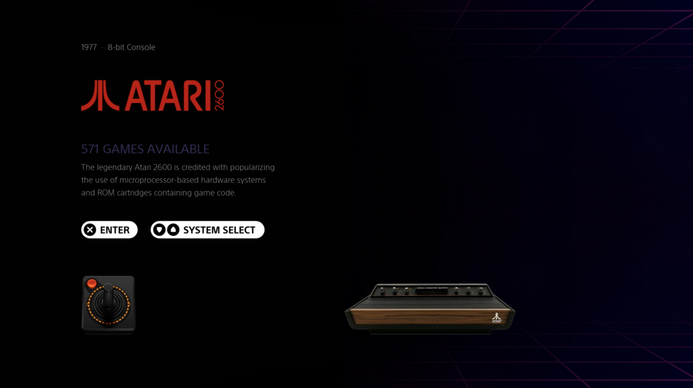
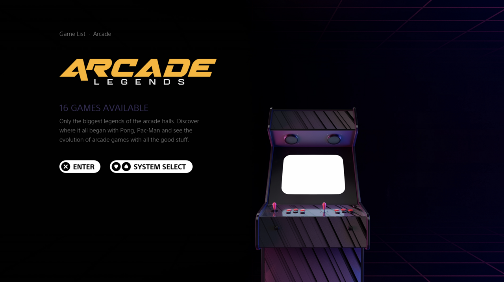

## VIOLET BLOOM. Emulation Station Theme

The Violet Bloom theme is a powerfull combination out of elements of the Epic Noir theme and the CRT theme. Heavily graphically redesigned.
Together creating a truely modern and aestheticly pleasing experience across Emulation Station. Heavily focused on console, controller and logo nostalgia.

## ORIGINAL THEMES CREDIT:

EPIC NOIR:
Original ideas by Chicuelo and brought to life in collaboration with Nick L (c64-dev).

CRT THEME:
Originally based on the Carbon theme by Eric Hettervik; and then rebuilt by Alphatoanant.

## SCREENSHOTS

##  Installation Instructions

Run this command on your RetroPie system to download the Violet-Bloom theme:

git clone https://github.com/Midifreakz/violet-bloom.git /etc/emulationstation/themes/violet-bloom/

✅ This will:

Download the latest version of the theme from GitHub.
Place it inside EmulationStation's theme directory.

You can then select it in the Emulation Station UI. 

---

## Features

* Clean interface. 
* Easily editable for more systems ==> Just add the system of your choosing from "_unfinished_systems" to the main folder and edit to your likings.
* Customisable Poster (background) overlay for every system.
* Collections supported by adding custom folders.
* Support for boxart and video.

## Future improvement plan:

* Develop grid and detailed view. (only video view is working wel for now).
* Designing more systems. 
* Suggestions are welcome

#### License

This work is licensed under a [Creative Commons Attribution-NonCommercial-ShareAlike 4.0 International License](http://creativecommons.org/licenses/by-nc-sa/4.0/). \

ALLOWED:
- Share and duplicate as it is
- Edit, alter, change it

REQUIREMENTS:
- Attribution, give credit to the creators
- Indicate changes to the theme
- Publish the changes under the same license

PROHIBITED:
- Commercial distribution

---

#### Artwork Credits

Artwork created by Midifreakz with Freepik.com assets and original device photography.

