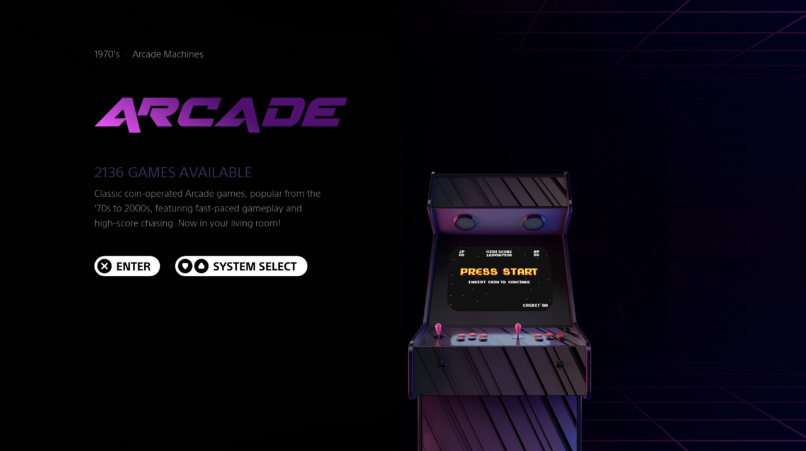

## VIOLET BLOOM theme by Midifreakz.

Combined elements of the Epic Noir theme and the CRT theme to create a truely modern and aestheticly pleasing experience across Emulation Station.
Heavily focused on console & controller and logo nostalgia.

EPIC NOIR:
Original ideas by Chicuelo and brought to life in collaboration with Nick L (c64-dev).

CRT THEME:
Originally based on the Carbon theme by Eric Hettervik; and then rebuilt by Alphatoanant.

## 📸 Preview

Here are some screenshots of the Violet-Bloom theme in action:

---

### License

This work is licensed under a [Creative Commons Attribution-NonCommercial-ShareAlike 4.0 International License](http://creativecommons.org/licenses/by-nc-sa/4.0/). \

ALLOWED:
- Share and duplicate as it is
- Edit, alter, change it

REQUIREMENTS:
- Attribution, give credit to the creators
- Indicate changes to the theme
- Publish the changes under the same license

PROHIBITED:
- Commercial distribution

### Please note:
By downloading and installing this theme it will be assumed that you own and possess the rights for all ROMs you intend to use. This is a free theme so you can install it and share it with others - **but you are *not* allowed to sell or generate any kind of monetary profit from this theme. Please see the 'License' section above for more details.**

---

### Artwork Credits

Artwork created by Midifreakz with Freepik.com assets and original device photography.

###### [back to top](https://github.com/c64-dev/es-epicnoir#epicnoir-retropie-theme)

---

### Features

* Dark and clean interface
* Controller and Console elements for systems. > Work in progress
* Customisable Poster for Every System
* Collections supported by adding custom folders.
* Support for boxart and/or video.

